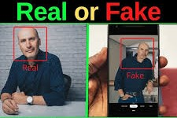

# Real_Fake_NeuralNet_DeepLearn
# Deep Learning Neural Network Model for Real vs. Fake Image Detection



This repository hosts a deep learning neural network model designed to distinguish between real and fake images of people. The ability to identify manipulated or synthetic images has become increasingly important in today's digital landscape, where image manipulation and deepfake technologies are on the rise. This model helps address these concerns by providing an automated means to detect the authenticity of images.

## Overview

Fake image detection is a critical task in image forensics and content verification. The deep learning model included in this repository has been trained on a diverse dataset of both real and fake images of people. It leverages convolutional neural networks (CNNs) and advanced deep learning techniques to analyze and classify images as either real or fake.

## Key Features

- **High Accuracy:** The model has been fine-tuned and optimized to achieve a high accuracy rate in distinguishing between real and fake images.

- **Scalability:** You can easily integrate this model into various applications, services, or platforms to automate the detection of fake images.

- **Customization:** The model can be further fine-tuned or customized to suit specific use cases and requirements.

## Dataset

To ensure the robustness and reliability of the model, a carefully curated dataset of real and fake images of people was used for training and testing. The dataset is not included in this repository due to size constraints, but you can obtain a similar dataset from reputable sources or collect your own data for training.

## Usage

Using the fake image detection model is straightforward. You can use it to classify images as real or fake by providing the image as input. The model will return a confidence score or probability indicating the likelihood that the input image is fake.

Here's a simple example in Python to use the model for image classification:

```python
from fake_image_detection import FakeImageDetector

# Initialize the model
model = FakeImageDetector()

# Load an image for analysis
image_path = "path_to_image.jpg"

# Detect whether the image is real or fake
is_fake, confidence = model.detect_fake_image(image_path)

if is_fake:
    print(f"The image is fake with a confidence score of {confidence}")
else:
    print(f"The image is real with a confidence score of {confidence}")
```

You can integrate this code into your applications or services to automate the process of identifying fake images.

## Dependencies

To use this model, you'll need the following dependencies:

- Python 3.x
- TensorFlow
- Keras
- OpenCV
- NumPy

You can install these dependencies using `pip`:

```bash
pip install tensorflow keras opencv-python-headless numpy
```

## Training Your Own Model

If you have a specific dataset or requirements, you can train your own fake image detection model. We recommend leveraging transfer learning with pre-trained models like VGG, ResNet, or Inception for optimal results. The provided model in this repository can serve as a starting point for your custom model.

## Contributing

We welcome contributions and improvements to this project. Whether you want to enhance the model's accuracy, add new features, or improve the documentation, feel free to open issues and pull requests.

## License

This project is licensed under the MIT License. Please refer to the [LICENSE](LICENSE) file for more details.

## Acknowledgments

We extend our gratitude to the open-source deep learning community and the developers of the libraries and tools that make this project possible. Your contributions to the field of image forensics are greatly appreciated.

Enjoy using the fake image detection model, and help make the digital world a safer place!
